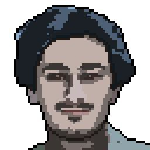

# Hello, world!

Привет, меня зовут **Мунир**, я начинающий фронтенд-разработчик. И вот несколько фактов обо мне:

- мне 26 лет
- живу в Москве
- увлекаюсь кино, музыкой, историей, программированием, ИИ
- студент курса Frontend-разработчик от [Нетологии](https://netology.ru/)
- есть свой бренд одежды [LUQ](https://instagram.com/luq.wear)

Моей основной целью после окончании курса является написание удобного и отзывчивого сайта для моего бренда.

